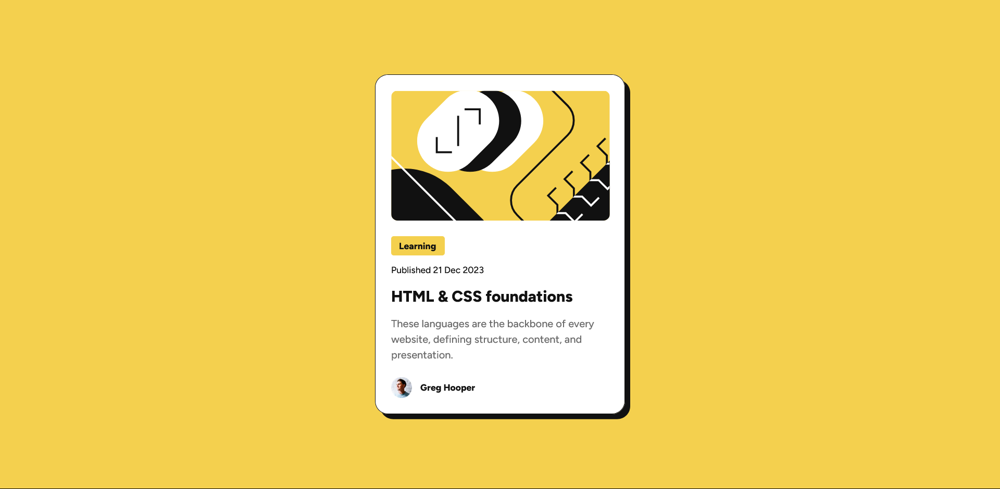
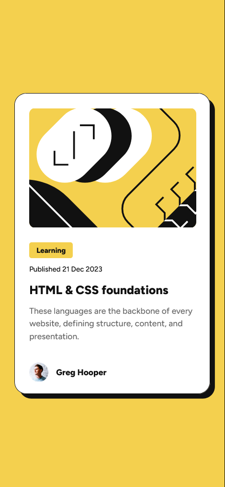

# Frontend Mentor - Blog preview card solution

This is a solution to the [Blog preview card challenge on Frontend Mentor](https://www.frontendmentor.io/challenges/blog-preview-card-ckPaj01IcS).

## Table of contents

- [Overview](#overview)
  - [Screenshot](#screenshot)
  - [Links](#links)
- [My process](#my-process)
  - [Built with](#built-with)

## Overview

### Screenshot

- Desktop version

- Mobile version

### Links

- Live Site URL: [Blog Preview Card](https://blogcard-chrisdzasc.netlify.app/)
- Solution URL: [Frontend Mentor Solution](https://www.frontendmentor.io/solutions/blog-preview-card---mobile-first-Jim3ZoMqvM)

## My process

### Built with

- Semantic HTML5 markup
- CSS custom properties
- Flexbox
- CSS Grid
- Mobile-first workflow
